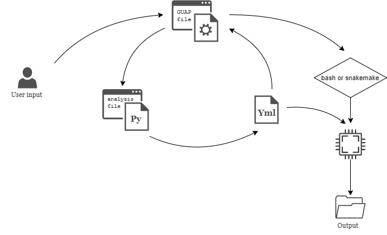
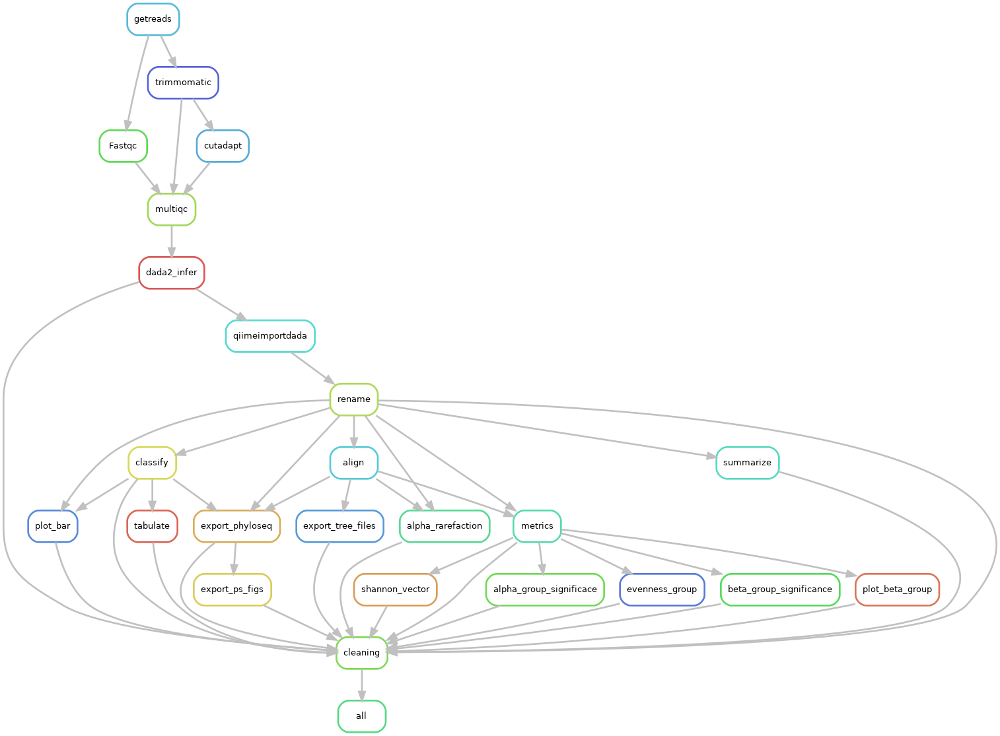

# GUAP

---

**G**enomics **U**nit **A**nalysis **P**ipelines (**GUAP**), a collection of workflows and pipelines usually conducted as a routine NGS work. GUAP works on Linux operating system and is called via command line interface. 

The main idea of GUAP is to provide reproducible analysis while having the ability to fine-tune the workflow depending on samples condition, In addition of being fast and easy to use. The user specifies the directory containing the fastq files, the output directory name and the analysis pipeline. Using command line options the user can specify the parameters of the workflow. 

A run my be as basic as:

```bash
$ GUAP 16s -i indir -o outdir -m sample-metadat.csv -c classifier.qza
```

or the user can specify much more specifications:

```bash
$ GUAP 16s -i samples -o out -m sample-metadata.tsv \
					 -c QIIME2_silva/Silva_Classifier.qza \
					 --no-trimmomatic -t 65 -mo 4 -n run1 --bash \
					 -cm pooled --export-figs --condition-name condition \
					 -ef 9 -er 10 --cutadapt 
```
---
### GUAP currently supports the following workflows:

- 16s analysis
- miRNA analysis (Under dev)
- RNAseq analysis (Under dev)
- Whole genome shotgun sequencing (Under dev)
- Modules: (Under dev)
    - Aligners (bwa, hisat2, bowtie and bowtie2)
    - QC ( trimmomatic, cutadapt, fastqc and multiqc)
    - custom tools parallelization (experimental)

---

### How does GUAP works

GUAP uses Conda to handle the software installation and packages, it can either use bash scripts or Snakemake workflow to perform the analysis. All the user parameters are stored in a config yaml file and depending on the user preference the config file is handled in the appropriate workflow engine. 



When the user installs GUAP for the first time GUAP's folder which contains all the scripts will be moved to the home directory and a function that calls GUAP form anywhere in terminal will be stored in .bashrc file. when the user calls GUAP a bash file handles the first argument and figure out which workflow to use, then sends the rest of the parameters to the correct python file which handles the parameters and create the config file and the samples table file, the main GUAP script will then parse the config file to store all the parameters in memory, and uses snakemake or bash according to the user input.

   

## GUAP **Tutorial**

### 16s basic workflow:

16s analysis pipeline starts with QC including fastqc, trimmomatic and removing primers with cutadapt, the following step is ASV generation and can be done in three ways, DADA2 in R, which is the defaults as it the fastest and produced better results during our testing, DADA2 in QIIME2 and deblur. The workflow will continue then with taxonomy classification which can be also done in DADA2 or using QIIME2 Naive-bayes classifier. Phylogenetic tree will be generated with QIIME2 align maftt fast tree and the user can specify whether or not to perform downstream analysis which includes alpha and beta diversity and barplots. 

here is an example run using DADA2:

```bash
GUAP 16s -i inputdir -o outputdir \
		 -m metadatafile.tsv -c calssifier.qza \
		 --remove-primers -fp AAATTTGGGCCC -rp TTAAGGCC \
		 --downstream --export-figs --condition-name condition \
		 --name name_of_analysis
```

This will run the following workflow:



## Options and configurations:

### Required options:

`-i` , `--input` is input directory that contains all fastq files, GUAP identifies the naming pattern and extracts the ID of sample and generate sample table containing samples information like extension and Paired End or not. 

`-o` , `--output` is output directory which will contain all the results

`-m`, `--metadata` is the samples metadata file containing samples IDs and columns of  conditions.

`-t`, `--threads` number of threads to be used, GUAP requires minimum of `4` threads and will use all available threads if wasn’t specified.

`-c` , `--classifier` classifier file (qza or fastq.gz) files for the use with QIIME2 or DADA2 

### Basic configuration:

`--bash` will use the bash scripts to perform the analysis, bash is a slower than snakemake and prints more output, useful when monitoring a specific run

`--downstream` performs QIIME2 downstream analysis but it needs `-d` , `--sampling-depth` and `-md` , `--max-depth` sampling depth for QIIME2 core phylogney metrics and max depth for alpha rarefaction if the user don’t specify any GUAP will check stats file of ASV generation step and will fetch the sampling depth as the minimum sampling depth found in samples and will the use the maximum depth found in samples for alpha rarefaction.

`--export-figs` will use the exported phyloseq object to generate alpha and beta diversity plots in addition to heatmaps and counts tables, but it requires condition name, `--condition-name`

### QC configuration:

`--skip-QC` will skip fastqc step, `--skip-trimmomatic` will skips trimmomatic step.

`--remove-primers` will use cut adapt to remove the primers but it requires `-fp` , `--forward-primer`  and `-rp` , `--reverse-primer` 

minimum length of read can specified as `--trim-min-length` for trimmomatic and `--min-length` for removing primers ( cutadapt )

### ASV generation:

DADA2 can be configured as follows:

`-tf` ,  `--trunc-f` and `-tr`, `--trunc-r` for truncation length forward and reverse, default = `0`

`-l` ,  `--trim-l` and `-r`, `--trim-r` for trimming forward and reverse, default = `0`

`-ef` ,  `--maxee-f` and `-er`, `--maxee-r` for maximum error forward and reverse, default = `4` and `5`

`-mo` , `--min-overlap` is for minimum overlapping base pairs for merging, default = `10`

`-cm` , `--chimera-method` to choose chimera method for removing chimera either `consensus` or `pooled`, default = `consensus`

`--use-QIIME2` to perform DADA2 using QIIMe2

`--deblur` to use deblur instead of DADA2 and you can specify `-L` , `--deblur-trim-length` for deblur trim length

NOTE: `--use-QIIME2` and `--deblur` will always use QIIMe2 classifier and can’t be used with DADA2 classifier in this version.

### Classifications:

`--choose-classifier`  allows the user to choose between `dada` and `qiime`  to classify taxonomy default =  `qiime`

`--train` will train the classifier for QIIMe2 naive classifier requires

`--t-i-seqs`  representivie sequences file (qza or FASTA)
`--t-i-taxa`  taxonomy file (qza or csv)
`--trainset-minlength`  length of amblicons to be exclude if lower
`--trainset-maxlength`  length of amblicons to be exclude if greater
`-fp`, `--forward-primer`  forward primer sequence
`-rp`, `--reverse-primer`  reverse primer sequence 

### Other options:

`--snakemake-dry-run` can be used to perform a dry-run and `--snakemake-dag` will generate rules graph of the analysis.

When using `--bash` tag you can continue the analysis if it stopped at specific point with `--continue` which uses a hidden text file in the analysis directory to store the name of the finished steps and will skip the steps found in the file.

### All options:

```jsx
REQUIRED:
 -i, --input       DIR     input directory 
 -o, --output      DIR     output directory
 -m, --metadata    FILE    metadata file 
 -t, --threads     INT     Number of threads to use 
 -c, --classifier  FILE    classifier file (should be either
                           .qza file use with QIIME2 or 
                           fasta file for use with DADA2)
________________________________________________________________________________
configurations:
basic:
 --bash                    uses bash scripts instead of snakemake
 --downstream              performs some downstream analysis in QIIME2 
   -d, --sampling-depth  INT   Sampling Depth for core-mertic phylogenetic
   -md, --max-depth      INT   Maximum Sampling Depth for alpha-rarefaction
 --export-figs             exports phyloseq basic figures 
    requires:                                   
  --condition-name STR     condition name in metadata file
 -n, --name        STR     name of the analysis
 --verbose                 print many output (most effective in snakemake mode)
 --continue                continue the analysis when re-run 
 --snakemake-dag           Exports Rules DAG for the analysis
 --snakemake-dry-run       performs snakemake dry run

QC:
 --skip-QC                     skipps fastqc step

 --skip-trimmomatic            skipps trimmomatic step
 --trim-min-length      INT    trimmomatic minimum length of read

 --remove-primers              perform cutadapt to remove primers
                                  (requires: -fp [forward primer sequence], 
                                             -rp [reverse primer sequence])
 --min-length           INT    cutadapt min length [default=50]

ASV generation:
DADA2 
 -tf,--trunc-f          INT    trunclength Forward [default=0]
 -tr,--trunc-r          INT    trunclength Reverse [default=0]
 -l,--trim-l            INT    trunclength Forward [default=0]
 -r,--trim-r            INT    trunclength Reverse [default=0]
 -ef, --maxee-f         INT    maxEE Forward [default=4]
 -er,--maxee-r          INT    maxEE Reverse [default=5]
 -mo,--min-overlap      INT    minimum overlap to merge [default=10]
 -cm, --chimera-method  [consensus|pooled] chimera method [default=consensus]

 --deblur                       uses deblur to generate ASV table
 -L, --deblur-trim-length INT   Deblur trim length (required with --deblur)

 --use-QIIME2                   uses DADA2 in QIIME2 rather than R

Classification:
 --choose-classifier    [dada|qiime]    Choose to classify taxanomy defualt: qiime
 --train    trainset for qiime2 naive classifier [can't be used with (dada classifier))]
   requires:
 --t-i-seqs            FILE    representivie sequences file (qza or FASTA)
 --t-i-taxa            FILE    taxonomy file (qza or csv)
 --trainset-minlength  INT     length of amblicons to be exclude if lower   
 --trainset-maxlength  INT     length of amblicons to be exclude if greater
 -fp, --forward-primer STR     forward primer sequence (used with cutadapt and train set)
 -rp, --reverse-primer STR     reverse primer sequence (used with cutadapt and train set)
```

### Example of Output directory structure and files:

The output consists of the following;

- Run information files: The command used, config file and samples info table
- R phyloseq object
- QIIME files include
    - ASV sequences and table
    - taxonomy
    - alignments
    - 13 downstream files
    - 9 visualizations files
- phyloseq figures
    - Bar plots
    - alpha diversity
    - beta diversity
    - heatmap
- Tables include
    - relative abundance tables
    - absolute abundance tables
    - alpha diversity metrics
    - sample filtration stats

---

# GUAP OLD

**G**enomics **U**nit **A**nalysis **P**ipelines (aka. **GUAP**) is a collection of bash scripts that performs several pipelines usually conducted as a routine NGS work. The script works via command line interface. the user can give a samples directory containing all samples and choose the desired analysis pipeline and the program will perform all the upstream analysis. The supported pipelines are:

- Metagenomics pipeline ( metagenomes identification using kraken)
- miRNA analysis 1 ( standard genome alignment pipeline of miRNA)
- miRNA analysis 2 ( supervised miRNA analysis pipeline)

---

- List of used software:
    - Kraken v.1.1.1
    - KronaTools v.2.7.1 - ktImportTaxonomy
    - trimmomatic v.0.39
    - cutadapt v.2.8
    - hisat2  v.2.2.1
    - bwa v.0.7.17-r1188
    - bowtie v.1.2.3
    - bowtie2 v.2.4.1
    - samtools v.1.10
    - htslib v.1.10.2
    - bedtools v.2.27.1
    - python v.3.8.5
    - pandas v.1.2.2
- Scripts

    ```bash
    .
    ├── V0.9
    │   ├── GUAP
    │   ├── Scripts
    │   │   ├── count_human.sh
    │   │   ├── functions.sh
    │   │   ├── indexes.sh
    │   │   ├── merge.py
    │   │   ├── pipelines.sh
    │   │   └── prepare_sample_table.py
    │   └── snakemake
    │       └── snakemake_miRNA
    │           ├── config.yaml
    │           ├── rules
    │           │   ├── common.smk
    │           │   ├── miRNA_direct.smk
    │           │   ├── miRNA_second.smk
    │           │   └── QC_cutadapt.smk
    │           ├── samples.tsv
    │           └── Snakefile
    └── v1.0
        ├── config
        │   ├── config.sh
        │   └── config.yaml
        ├── engine
        │   ├── bash
        │   │   ├── common
        │   │   │   ├── common_functions.sh
        │   │   │   └── indexes.sh
        │   │   ├── metagenomics
        │   │   │   ├── functions.sh
        │   │   │   ├── Kraken_direct.sh
        │   │   │   └── Kraken_rm_human.sh
        │   │   └── miRNA
        │   │       ├── functions.sh
        │   │       ├── miRNA_1.sh
        │   │       └── miRNA_2.sh
        │   ├── Nextflow
        │   └── snakemake
        │       ├── miRNA_v1
        │       │   ├── rules
        │       │   │   ├── common.smk
        │       │   │   ├── miRNA_direct.smk
        │       │   │   ├── miRNA_second.smk
        │       │   │   └── QC_cutadapt.smk
        │       │   └── Snakefile
        │       └── miRNA_v2
        │           ├── rules
        │           │   ├── common.smk
        │           │   ├── miRNA_direct.smk
        │           │   ├── miRNA_miRBase.smk
        │           │   └── QC_cutadapt.smk
        │           ├── scripts
        │           │   ├── count_human.sh
        │           │   ├── merge.py
        │           │   └── merge_single.py
        │           └── Snakefile
        ├── GUAP
        └── Scripts
            ├── count_human.sh
            ├── merge.py
            └── prepare_sample_table.py
    ```

---

## Main workflow

GUAP takes several options as shown in the following block:

```bash
__usage="
GUAP v1.0
Usage: $(basename $0) [OPTIONS]

GUAP -i <inputdir> -o <outputdir> -c <analysis> -a <aligner> -t INT 

Options:
  -c <miRNA|kraken>                     Choose analysis                default = kraken
  -a <bwa|bowtie|bowtie2|hisat2>        Choose aligner                 default = bowtie2
  -i <str>                              Input directory path
  -o <str>                              Output directory path
  -t <int>                              Number of threads              default = 50
  -m <first|second>                     miRNA pipeline choise
  -e <bash|snakemake|nextflow>          use snakemake, nextflow or bash
  -h                                    Help message ( This message )
  -y                                    skip continue check
  -k                                    Direct flag
"
```


### Metagenomics pipeline using kraken:

Run the command:

`$ ./GUAP -i inputdir -o outputdir -a bowtie2 -c kraken -t num_of_threads` 

The script will first check the number of samples and if they are paired ended or not using the function `sample_check` from `functions.sh` according to exit code of the function the pipeline will continue with SE or PE analysis, the example provided upove is with single ended analysis.

The main analysis starts by trimming samples using `trimmomatic` then aliging samples to refference human genome according user defined aligner, unmapped reads will then be extract from sorted bam file using `samtools` the unmapped reads will then be used with `kraken` with k2_pluspfp database, korona figure will then be generated from output file using `ktImportTaxonomy` 


### miRNA tradiotinal pipeline

This pipeline is the traditional pipeline for miRNA analysis 

Run the command:

`$ ./GUAP -i inputdir -o outputdir -a bowtie -c mirna -t num_of_threads -m second` 

The script will first check the number of samples and if they are paired ended or not using the function `sample_check` from `functions.sh` according to exit code of the function the pipeline will continue with SE or PE analysis, the example provided upove is with single ended analysis. 

The main analysis starts by trimming samples using `cutadapt` then aliging samples to refference human genome using `bowtie` the resulted sam files of all samples will then be used to generate counts using `featureCounts` and file will be modified by the command `tail -n +2 all.counts | cut -f 1,7- > all.txt` .


### miRNA supervised pipeline

This pipeline is the subervised pipeline for miRNA analysis 

Run the command:

`$ ./GUAP -i inputdir -o outputdir -a bowtie -c mirna -t num_of_threads -m first`

The script will first check the number of samples and if they are paired ended or not using the function `sample_check` from `functions.sh` according to exit code of the function the pipeline will continue with SE or PE analysis, the example provided upove is with single ended analysis. 

The main analysis starts by trimming samples using `cutadapt` then aliging samples to samples using `bowtie` to mirbase database with options `bowtie -n 0 -l 32 --norc --best --strata -m 1 --threads $1 $bowtie_index_mirbase <input> --un <unmapped fastaname> -S <sam file>` then convert sam to sorted indexed bam file using `samtools` the bam file will then be xounted using `samtools idxstats | cut-f1,3` to counts file. The unmapped reads wil then be aligned using `bowtie` to human genome using the command `bowtie -n 1 -l 32 --norc --best --strata -m 1 --threads $1 $bowtie_index_hum <input> -S <output>` then the sam file will be converted to bam and tagged using the command `bedtools tag -i <input> -files $hsa-genome-miRBase22v-onlymiRNAs-convforTagBAM.bed -names -tag XQ > <tagged_bam>` the output will be a tagged bam file. to count the file a list of all miRNA names is looped and counted each one using the command `samtools view $i | grep $j | wc -l` which `i` is the sample name and `j` is miRNA name. 

All counts files from mirbase and mapped to genome are then merged together using `merge.py` python script. This script takes the names of the samples and creates a dictionary, with keys > sample names and values > dictionary with keys > mirna name and value > counts data. The data are filled by firstly looping on all mirbase files and generating counts then looping on all genome files and adding the value of each mirna name to there corresponding values. the resulted dictionary is then exported as a CSV file with all counts data. 

---

## Datasets used:

1. Kraken database: k2_pluspfp_20210127
2. bowtie human index
3. bowtie mirbase index
4. bwa human index (GRCH38)
5. bowtie2 human index (GRCH38)
6. hisat2 human index (GRCH38)
7. mirbase annotation: human gff3 file 
8. miRNA names list

